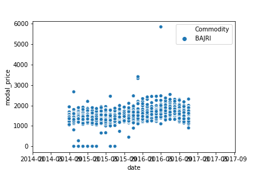
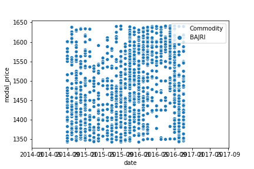
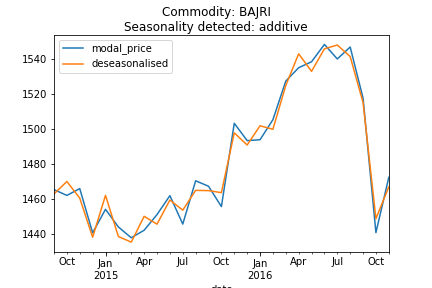
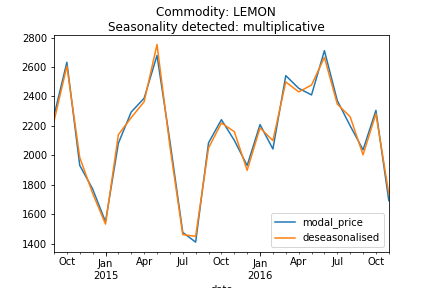
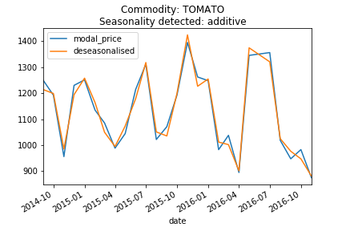
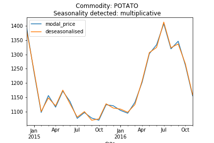
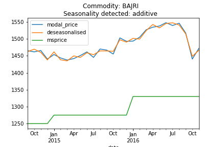

# APMC-Data-Exploration

 

## Objectives
1. Test and filter outliers.
2. Understand price fluctuations accounting the seasonal effect
	1. Detect seasonality type (multiplicative or additive) for each cluster of APMC and commodities
	2. De-seasonalise prices for each commodity and APMC according to the detected seasonality type
3. Compare prices in APMC/Mandi with MSP(Minimum Support Price)- raw and deseasonalised
4. Flag set of APMC/mandis and commodities with highest price fluctuation across different commodities in each relevant season, and year.

 

## Approach and Methodology

This is merely a summary of the approach and methodology used to reach the objectives. For details, refer the respective python notebooks.

#### Data Cleaning
* Handled the case difference in commodity name, and minor typos.
* Found null values and substituted them using forward filling technique.
* Found zero price values and substituted them using appropriate technique.
* Saved the cleaned files in ./data/

#### Outlier Detection and Filtering
* Detected outliers for each commodity separately.
* Used the modal price as outlier indication, because it is an overall representative of prices and we work with these values later also.
* Removed the outliers using IQR method.
* Scatter plots comparing data with and without outliers for each commodity can be found in ./data/outlier-handling/

#### Seasonality Detection and Filtering
* Detected seasonality type (multiplicative/additive) for each combination of APMC and Commodity, and discretely.
* Used the autocorrelation of residuals to decide which model suits better additive or multiplicative.
* Deseasonalised the series according to type of seasonality detected.
* Plotted lines plots comparing raw and deseasonalised modal prices, can be found in ./visuals/deseasonalisation/
	* /apmc/ - contains plots for APMC-wise analysis by aggregating the commodities (an overview of every APMC cluster)
	* /commodity/ - contains plots for Commodity-wise analysis by aggregating the APMCs (an overview of every Commodity cluster)
	* /apmc-commodity/ - contains plots for the analysis of each commodity in each APMC.

#### Raw, Deseasonalised and Minimum Support Price Comparison
* Combined both the datasets for the common Commodities.
* Deseasonalised the modal prices for these commodities.
* Adjusted the MSP timeseries for easy merging with modal price timeseries.
* Created line plots for fulfilling the purpose (can be found at ./visuals/msp-comparison/)
	* /commodity/ - contains plots for the Commodity-wise price comparison (Commodity cluster overview)
	* /apmc-commodity/ - contains plot for price comparison for each commodity in each APMC.

#### Find set of APMC/Commodity with highest price fluctuations
* Used two methods for finding fluctuations
	* General method : Fluctuation = Maximum price - Minimum price
	* Ratio method: Fluctuation = Maximum price / Minimum price
* Plotted price fluctuations along with the minimum, maximum and modal price values for each APMC and commodity pair. (./visuals/fluctuations/apmc-commodity/)
* Aggregated and restructured data 
	* by year and commodities to find commodities with highest fluctuation in prices per year
	* by year, commodities and APMCs to find APMCs with highest fluctuation for each commodity per year.
* The results were plotted in form of heatmaps. (./visuals/fluctuations/commodity-year)

 

## Analysis and Interpretation of results

#### Outlier filtering
* The outlier filtering results can be analysed for each crop by viewing the commodity_outliers.png and commodity_cleaned.png.
* Only for the commodities having decent amount of price entries, we can see good results.
* For example, the BAJRI_outliers.png and BAJRI_cleaned.png are given below. We can see that in scatter plot containing the outliers, most of the data points are clustered towards the center of the graph, while there are a few outliers spread accross the edge of the graph. After cleaning the outliers, we can see that the price values are much more evenly spread out in the graph.
* Similary, the plots can be compared for each category from the directory ./visuals/outlier-handling/

 

 

#### Seasonality Detection
* For the results of sesasonality detection and deseasonalisation, the graphs can be found in the directory ./visuals/deseasonalisation/
* The graphs illustrate the raw and deseasonalised modal prices 
* For example the graphs given below illustrated the prices for the commodities Bajri, Lemon, Potato and Tomato. These graphs give an overall overview of the prices aggregated from all the APMCs. We can see that the for the commodities Bajri and Tomato we detected an additive seasonality type, while for lemon and potato we detected a multiplicative seasonality type.

  
  

* Similarly if we go into the directory ./visuals/apmc-commodity/, we could get the plots of each commodity under each apmc. The seasonality was detected individually and the seasonality component was removed accordingly for each apmc-commodity pair. Below are some examples:

  
  

* The other plots can also be explored and analysed for inferences specific to a commodity or an APMC, or a commodity in an APMC.

 

#### Comparison with Minimum Support Price
* The directory ./visuals/msp-comparison contains the visuals for commodity-wise and apmc-commodity-wise comparison for the common commodities among both the datasets.
* Below are some examples of the commodity overview plots.

 .png)

 

#### Finding entities with highest price fluctuation per year.
* For comparing the price fluctuations for each apmc-commodity pair, the line plots in the directory ./visuals/fluctuations/apmc-commodity/ can be used.
* There are a vareity of plots, which shows the trends in price fluctuation. Some commoditites experiences a decrease in the price fluctuations (fluctuation line with positive slope), while some commodities showed in increase in the same (fluctuation line with negative slope). For some commodities the fluctuation was found to be more than 100%, the fluctuation line lied between the minimum and maximum price lines.
* For example, the graph below showcases the fluctuation for commodity BOTTLE GOURD in the APMC Ahmednagar. We can see that the fluctuation in prices has been increasing over the time here, crossing even 100% mark in the beginning of 2016

* Similarly the fluctuation trends can be found out for other commodities and APMCs also.
* The APMCs exhibit highest price fluctuation for each commodity per year can be seen in heatmaps stored in ./visuals/fluctuations/commodity-year/
* The heatmap "commodity | year.png" ranks the APMCs for respective commodity and year. The numeric value in each cell denotes the ratio of max:min price. Higher the ratio, more is the price fluctuation. The heatmaps also shows the price fluctuation for same APMCs for the other years also. (0 value indicates the absence of data in almost all of the cases)
* For example, let's take the commmodity Black Gram. Among the plots given below, the first heatmap shows the APMCS with highest price fluctuations for the year 2014, while the second shows the same for the year 2015. We can see that in 2014 APMC Latur has highest price fluctuation, while in 2015 it is at the 9th position. In 2015, the APMC Chikhali has the highest price fluctuation but it wasn't even among the top 10 in 2014.
	
  

* Similarly analysis can be done for the other commodities also.

 
